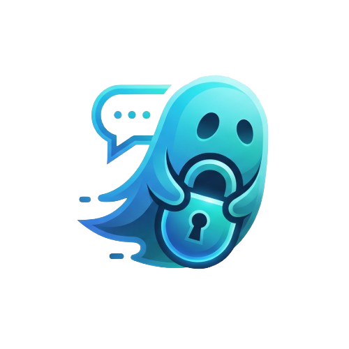

<p align="center">
  
</p>


<h3 align="center">Zero Metadata · Zero Logs · True Peer-to-Peer Encryption</h3>

---

## Overview

Ghost Messenger is a privacy-first, peer-to-peer encrypted messaging application. Messages are transmitted directly between peers over an end-to-end encrypted WebRTC DataChannel. The application uses the Signal Protocol for message-level encryption; the signaling server only brokers the WebRTC handshake (SDP offer/answer and ICE candidates) and does not access message content.

The signaling server is intentionally designed to be metadata-minimal: it brokers connections and manages presence but does not persist or inspect message payloads.

### Key Principles

- Signal Protocol end-to-end encryption (Double Ratchet)
- Minimal server knowledge: the signaling backend is metadata-limited
- True peer-to-peer transport via WebRTC DataChannel
- BIP39 mnemonic identity backup and account recovery
- Encrypted local storage using SQLCipher for message history
- Serverless identities: no accounts, email addresses, or phone numbers required

---

## Architecture

```
Ghost Messenger
├── codechat_client/          # Flutter (Web) application
│   └── lib/
│       ├── core/
│       │   ├── crypto/       # BIP39 key management, Curve25519 identity
│       │   ├── signal/       # Signal Protocol session store (SQLite-backed)
│       │   └── storage/      # SQLCipher database helper
│       ├── services/
│       │   ├── app_state.dart        # Global app state + lifecycle
│       │   ├── connection_manager.dart # P2P orchestration
│       │   ├── p2p_service.dart       # WebRTC DataChannel management
│       │   └── signal_service.dart    # Signal Protocol encrypt/decrypt
│       └── ui/
│           ├── onboarding/   # Identity creation + mnemonic restore
│           ├── home/         # Chat list (recent conversations)
│           ├── chat/         # Real-time chat screen
│           └── theme/        # Dark theme & design system
│
└── codechat_signaling/       # Node.js signaling server
    └── src/
        ├── socket/           # Socket.IO event handlers
        ├── services/         # Presence registry, offline queue, ICE
        ├── routes/           # Health, readiness, metrics, ICE endpoints
        ├── middleware/        # Socket rate limiting
        └── utils/            # Logging, validation
```

### Connection Flow

```
  Client A                   Signaling Server                  Client B
     │                            │                               │
     │---- join(userCode) ------▶ │                               │
     │                            │ ◀---- join(userCode) --------- │
     │                            │                               │
     │---- signal(offer) --------▶ │ ---- signal(offer) --------▶ │
     │                            │                               │
     │ ◀--- signal(answer) ------- │ ◀--- signal(answer) -------- │
     │                            │                               │
     │ ◀════════ E2EE WebRTC DataChannel (P2P) ═════════════════▶ │
     │                   (Server no longer participates)           │
```

---

## Security Model

| Layer | Technology | Detail |
|---|---|---|
| Message Encryption | Signal Protocol (Double Ratchet) | Forward secrecy and post-compromise recovery per-message |
| Key Agreement | Curve25519 (X3DH) | Asynchronous handshake for establishing shared secrets |
| Transport | WebRTC DataChannel + DTLS | Encrypted peer-to-peer data transport |
| Identity Keys | libsignal_protocol_dart | Curve25519 keypairs |
| Identity Backup | BIP39 Mnemonic (12 words) | Offline recovery of identity |
| Local Storage | SQLCipher (sqflite_sqlcipher) | AES-256 encrypted message database |
| Key Storage | flutter_secure_storage | OS-level secure key storage (keychain / secure enclave) |
| Server Side | Minimal knowledge | Server relays SDP/ICE only; it does not access message content |
| Anti-Spoofing | fromCode validation | Sockets may only emit as their joined userCode |

---

## Getting Started

### Prerequisites

- Flutter >= 3.0.0 with web support enabled
- Node.js >= 18.0.0
- Docker (optional, for production deployment)

### 1. Clone the repository

```bash
git clone https://github.com/MasterZ1311/Ghost-Messenger.git
cd Ghost-Messenger
```

### 2. Start the signaling server

```bash
cd codechat_signaling

# Copy and configure environment variables
cp .env.example .env

# Install dependencies
npm install

# Run in development mode (auto-reload)
npm run dev

# Or run in production mode
npm start
```

By default the server starts on http://localhost:3000.

Verify the server is running:

```bash
curl http://localhost:3000/health
# → {"status":"ok", ...}
```

### 3. Run the Flutter client

```bash
cd codechat_client

# Get dependencies
flutter pub get

# Run on web (Chrome)
flutter run -d chrome
```

On first launch the application prompts to create a new identity or restore from a mnemonic.

---

## Configuration

Signaling Server (.env)

Key environment variables — see codechat_signaling/.env.example for details:

| Variable | Default | Description |
|---|---:|---|
| PORT | 3000 | HTTP server port |
| NODE_ENV | development | Runtime environment |
| CORS_ORIGINS | (empty = all) | Comma-separated allowed origins |
| STUN_URLS | Google STUN | Comma-separated STUN URLs |
| TURN_URLS | (optional) | TURN relay URL(s) |
| TURN_SECRET | (optional) | coturn static auth secret for ephemeral credentials |
| SIGNAL_RATE_MAX | 30 | Max signals per socket per window |
| QUEUE_TTL_MS | 30000 | Offline handshake buffer TTL |
| MAX_SOCKETS_PER_USER | 3 | Max concurrent devices per user |

Flutter Client

To point the client at a deployed signaling server, update the connection URL in lib/services/app_state.dart:

```dart
// lib/services/app_state.dart
_connectionManager!.connect('https://your-signaling-server.com');
```

---

## Production Deployment

The repository includes a production stack with Docker Compose.

```bash
cd codechat_signaling

# Configure environment
cp .env.example .env
# Edit .env: set CORS_ORIGINS, TURN_SECRET, TURN_REALM, etc.

# Start all services
docker compose up --build -d
```

The stack contains the following services:

| Service | Description |
|---|---|
| signaling | Node.js Socket.IO signaling server |
| redis | Redis (for horizontal scaling with @socket.io/redis-adapter) |
| turn | coturn TURN server for NAT traversal |
| caddy | Caddy reverse proxy with automatic TLS |

Note on TURN: STUN alone fails for a percentage of connections under symmetric NATs. Configure coturn with --use-auth-secret and set TURN_SECRET to enable time-limited ephemeral TURN credentials.

---

## Signaling API Reference

### HTTP Endpoints

| Method | Path | Description |
|---|---|---|
| GET | / | Service info |
| GET | /health | Liveness probe |
| GET | /ready | Readiness probe |
| GET | /metrics | Counts only (no PII): presence, queue, memory |
| GET | /api/ice-servers | STUN + optional TURN ICE server list |

### Socket.IO Events

Client → Server

| Event | Payload | Notes |
|---|---|---|
| join | userCode: string | Register presence |
| signal | { toCode, fromCode, signalData } | Relay SDP/ICE; fromCode must match joined code |
| check_presence | userCode: string | Query whether a user is online |

Server → Client

| Event | Payload | Notes |
|---|---|---|
| joined | { userCode } | Join acknowledged |
| signal | { fromCode, signalData } | Incoming relayed signal |
| peer_status | { toCode, status: 'queued' } | Recipient offline; signal buffered |
| presence_result | { userCode, online } | Presence query result |
| error_message | { code, message } | Error response |

---

## Tech Stack

Client (codechat_client)

| Technology | Purpose |
|---|---|
| Flutter | Cross-platform UI framework |
| flutter_webrtc | WebRTC DataChannel P2P transport |
| socket_io_client | Signaling server connection |
| libsignal_protocol_dart | Signal Protocol E2EE |
| sqflite_sqlcipher | AES-256 encrypted local message store |
| flutter_secure_storage | OS-level secure key storage |
| bip39 | BIP39 mnemonic generation & validation |

Server (codechat_signaling)

| Technology | Purpose |
|---|---|
| Node.js | Runtime |
| Socket.IO | Real-time WebSocket events |
| Express | HTTP server & REST endpoints |
| Helmet | HTTP security headers |
| express-rate-limit | HTTP rate limiting |
| pino | Structured JSON logging |
| ioredis + @socket.io/redis-adapter | Horizontal scaling adapter |

---

## Roadmap

- Push notifications for offline delivery (FCM/APNS)
- Group chat support (multi-party Signal Protocol sessions)
- Encrypted file transfer over DataChannel
- Deterministic key derivation from mnemonic (BIP39 KDF improvements)
- Join challenge-response for server-verifiable userCode ownership
- Mobile builds for Android and iOS
- Self-hosted deployment guide and packaging

---

## Contributing

Contributions are welcome. Please open an issue to discuss proposed changes before submitting a pull request.

1. Fork the repository
2. Create a feature branch: git checkout -b feat/your-feature
3. Commit your changes: git commit -m "feat: add your feature"
4. Push the branch: git push origin feat/your-feature
5. Open a Pull Request against MZ-Main

---

## License

This project is licensed under the MIT License.

---

<p align="center">
  Built for privacy by <a href="https://github.com/MasterZ1311">MasterZ1311</a>
</p>
